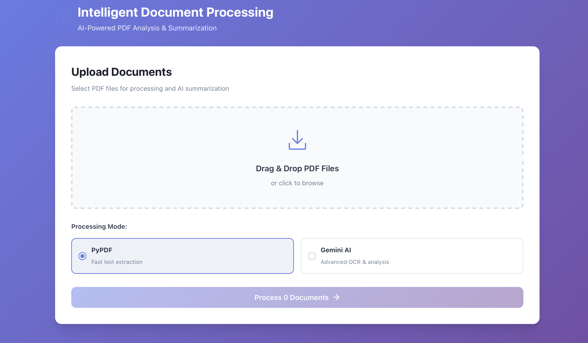
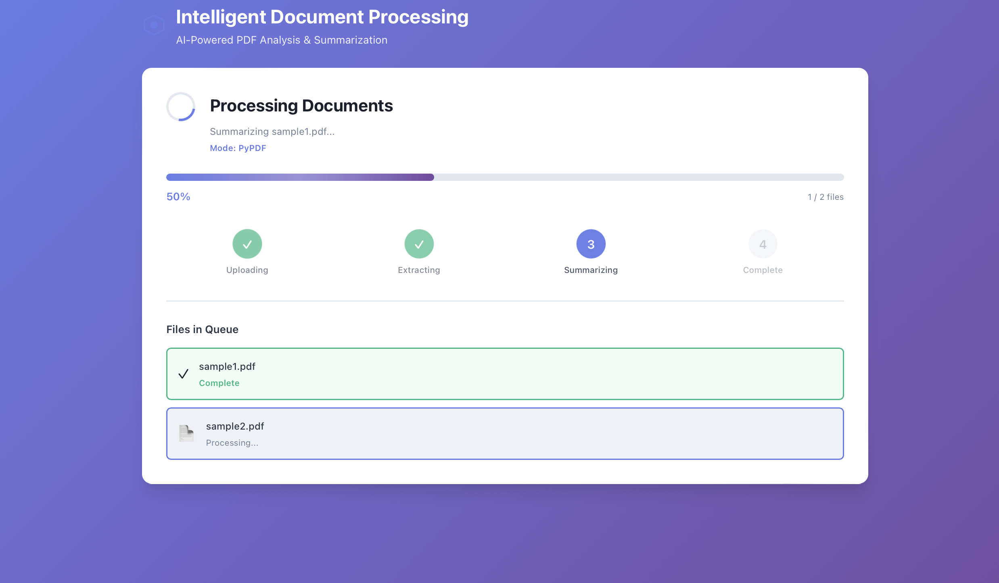
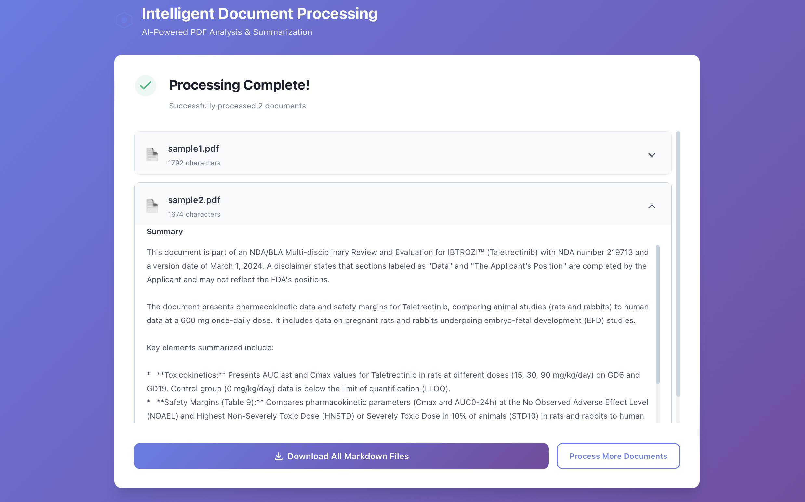

# Intelligent Document Processing System

A full-stack application for processing PDFs with AI-powered summarization. Features a professional React frontend, FastAPI backend, and async worker architecture.

## User Interface

**Home**



**Processing**



**Ready to download**



## Features

### 1. Web Interface

Modern React frontend with intuitive UI:

- **Drag & Drop Upload** - Drop files directly or browse to select
- **Multi-file Processing** - Upload and process multiple PDFs simultaneously
- **Real-time Progress** - Live progress tracking with visual feedback
- **Expandable Summaries** - View AI-generated summaries for each document
- **Bulk Downloads** - Download all results as individual files or ZIP archive
- **Responsive Design** - Works seamlessly on desktop, tablet, and mobile

### 2. PDF Processing

Upload one or more PDFs and choose processing mode:

**Gemini Mode:**

- Convert each PDF page to images
- Use Gemini 2.0 Flash to extract all content
- Special handling for figures, charts, and graphs
- AI-powered content extraction

**PyPDF Mode:**

- Fast text extraction using PyPDF
- Reliable for text-heavy documents
- Fallback extraction methods for problematic PDFs

### 3. AI Summarization

Automatic summarization with intelligent chunking:

- **Small documents** (≤ 5000 words): Single-pass summarization
- **Large documents** (> 5000 words): Multi-level chunked summarization
  1. Split into 5000-word chunks
  2. Summarize each chunk
  3. Combine intermediate summaries
  4. Generate comprehensive final summary

### 4. Async Task Queue

Built on Redis Streams for reliability:

- Non-blocking uploads (immediate response with task_id)
- Progress tracking via polling
- Scalable worker architecture
- Task persistence and recovery

### 5. Storage

All results stored in Redis with auto-expiration:

- Markdown files: `task:{task_id}:file:{filename}.md`
- Summaries: `task:{task_id}:summary:{filename}`
- Status: `task:{task_id}:status`

## Project Structure

```
simple-pdf-parser/
├── app/                        # Backend application
│   ├── main.py                 # FastAPI entry point
│   ├── config.py               # Configuration settings
│   ├── logging_config.py       # Logging configuration
│   ├── middleware.py           # Request/Response middleware
│   ├── exceptions.py           # Custom exceptions
│   ├── models/schemas.py       # Pydantic models
│   ├── routes/api.py           # API endpoints
│   └── services/               # Business logic
├── frontend/                   # React frontend
│   ├── src/
│   │   ├── components/         # React components
│   │   │   ├── Upload.jsx      # File upload with drag & drop
│   │   │   ├── Processing.jsx  # Progress tracking
│   │   │   ├── Results.jsx     # Results display
│   │   │   └── ErrorDisplay.jsx # Error handling
│   │   ├── App.jsx             # Main app component
│   │   └── config.js           # API configuration
│   ├── Dockerfile              # Frontend Docker image
│   ├── nginx.conf              # Nginx configuration
│   └── package.json            # Node dependencies
├── tests/                      # Backend test suite
│   ├── conftest.py             # Pytest fixtures
│   └── test_api.py             # API tests (83% coverage)
├── worker.py                   # Background PDF processor
├── Dockerfile                  # Backend Docker image
├── docker-compose.yml          # Multi-service orchestration
├── pyproject.toml              # Python dependencies
├── README.md                   # This file
├── DOCKER.md                   # Docker deployment guide
└── DEVELOPMENT.md              # Development guide
```

## Quick Start

### Recommended: Docker Setup 🐳

The easiest way to run the complete application:

```bash
# 1. Clone the repository
git clone <repository-url>
cd simple-pdf-parser

# 2. Create environment file
cp .env.example .env
# Edit .env and add your GOOGLE_API_KEY

# 3. Run setup script (builds and starts all services)
./docker-setup.sh

# Or manually:
docker-compose up -d
```

**Access the application:**

- **Frontend UI**: http://localhost:3000
- **API**: http://localhost:8000
- **API Docs**: http://localhost:8000/docs

See [DOCKER.md](DOCKER.md) for complete Docker documentation.

### Alternative: Local Development

For local development without Docker:

**Prerequisites:**

- Python 3.12+
- Node.js 20+ and npm
- Redis server
- Google Gemini API key
- Poppler utils (for pdf2image)

**Backend Setup:**

```bash
# 1. Install Python dependencies
pip install -e .

# For development (includes pytest)
pip install -e ".[dev]"

# 2. Configure environment
echo "GOOGLE_API_KEY=your_api_key" > .env
echo "REDIS_URL=redis://localhost:6379/0" >> .env

# 3. Start Redis
redis-server

# 4. Start Worker (Terminal 1)
python worker.py

# 5. Start API (Terminal 2)
python -m uvicorn app.main:app --reload
```

**Frontend Setup:**

```bash
# In a third terminal
cd frontend
npm install
npm run dev
# Frontend will be at http://localhost:5173
```

### Running Tests

```bash
# Run all tests with coverage
pytest --cov=app --cov-report=html

# View coverage report
open htmlcov/index.html

# Run specific tests
pytest tests/test_api.py -v

# Run tests in Docker
docker-compose exec api pytest tests/ -v
```

## Using the Application

### Via Web Interface (Recommended)

1. Open http://localhost:3000 in your browser
2. Drag and drop PDF files or click to browse
3. Select processing mode:
   - **PyPDF**: Fast, good for text-heavy documents
   - **Gemini AI**: Advanced, handles images, charts, complex layouts
4. Click "Upload and Process"
5. Watch real-time progress
6. View AI-generated summaries
7. Download markdown files (individual or ZIP)

### Via API

### 1. Upload PDFs

```bash
curl -X POST "http://localhost:8000/upload" \
  -F "files=@document.pdf" \
  -F "mode=pypdf"
```

**Response:**

```json
{
  "task_id": "abc-123...",
  "status": "queued",
  "files": ["document.pdf"],
  "mode": "pypdf"
}
```

### 2. Poll Status

```bash
curl "http://localhost:8000/status/abc-123..."
```

**Response shows progress:**

- Processing document...
- Summarizing document...
- Complete

### 3. Get Summaries

```bash
curl "http://localhost:8000/download/abc-123..."
```

**Response:**

```json
{
  "task_id": "abc-123...",
  "summaries": {
    "document.pdf": "This document discusses [AI-generated summary]..."
  },
  "markdown_download_endpoint": "/download-markdown/abc-123..."
}
```

### 4. Download Markdown (Optional)

```bash
curl "http://localhost:8000/download-markdown/abc-123..." -o results.zip
```

## API Endpoints

| Endpoint                       | Method | Description                    |
| ------------------------------ | ------ | ------------------------------ |
| `/upload`                      | POST   | Upload PDFs, returns task_id   |
| `/status/{task_id}`            | GET    | Check progress & summarization |
| `/download/{task_id}`          | GET    | **Get AI summaries (JSON)**    |
| `/download-markdown/{task_id}` | GET    | Download markdown files        |
| `/health`                      | GET    | Health check                   |
| `/docs`                        | GET    | Interactive documentation      |

## Architecture

```
┌──────────────────────────────────────────────────┐
│  Browser (http://localhost:3000)                 │
│  React Frontend + Nginx                          │
└──────────────────┬───────────────────────────────┘
                   │ HTTP/REST
                   │
┌──────────────────▼───────────────────────────────┐
│  FastAPI Backend (http://localhost:8000)         │
│  • Upload endpoint                               │
│  • Status polling                                │
│  • Results retrieval                             │
└──────────────────┬───────────────────────────────┘
                   │
                   │ Redis Streams
                   │ (Task Queue)
                   │
┌──────────────────▼───────────────────────────────┐
│  Redis (localhost:6379)                          │
│  • Task queue (Streams)                          │
│  • Status storage                                │
│  • Results cache                                 │
└──────────────────┬───────────────────────────────┘
                   │
                   │ Consumer reads
                   │
┌──────────────────▼───────────────────────────────┐
│  Background Worker                               │
│  1. Convert PDF → Markdown (PyPDF or Gemini)    │
│  2. Chunk text (5000 words)                     │
│  3. Generate AI summaries                        │
│  4. Store results in Redis                       │
└──────────────────────────────────────────────────┘
```

### Request Flow

1. **User uploads PDF** → Frontend sends to `/upload` endpoint
2. **API creates task** → Returns task_id, queues in Redis Stream
3. **Worker processes** → Picks up task, converts PDF, generates summary
4. **Frontend polls** → Checks `/status/{task_id}` every 2 seconds
5. **Results ready** → Frontend fetches from `/download/{task_id}`
6. **User downloads** → Optional markdown files from `/download-markdown/{task_id}`

## Key Features

✅ **Modern UI** - Professional React interface with drag & drop

✅ **Async Processing** - Non-blocking uploads with Redis Streams

✅ **AI Summarization** - Automatic summaries for all documents

✅ **Large File Support** - Chunked processing handles any size

✅ **Dual Processing** - Gemini vision or PyPDF extraction

✅ **Real-time Progress** - Live status updates with polling

✅ **Docker Ready** - Complete containerization with docker-compose

✅ **Scalable** - Horizontal scaling of workers

✅ **Production Ready** - Error handling, logging, monitoring, testing (83% coverage)

✅ **Responsive Design** - Works on desktop, tablet, and mobile

## Configuration

### Chunk Size

Adjust summarization chunk size in `worker.py`:

```python
CHUNK_SIZE = 5000  # words per chunk
```

### Expiration Time

Adjust Redis key expiration in `worker.py` and `main.py`:

```python
ex=3600  # 1 hour (default)
```

### Worker Name

Run multiple workers:

```bash
WORKER_NAME=worker_1 python worker.py
WORKER_NAME=worker_2 python worker.py
```

## Documentation

- **[README.md](README.md)** - This file, project overview and quick start
- **[DOCKER.md](DOCKER.md)** - Complete Docker deployment guide
- **[DEVELOPMENT.md](DEVELOPMENT.md)** - Development guide, testing, debugging
- **[frontend/README.md](frontend/README.md)** - Frontend-specific documentation
- **[API Docs](http://localhost:8000/docs)** - Interactive Swagger UI (when running)

## Technology Stack

### Frontend

- **React 18** - Modern UI library with Hooks
- **Vite** - Fast build tool and dev server
- **Nginx** - Production web server
- **CSS3** - Custom styling with animations

### Backend

- **FastAPI** - Modern async Python web framework
- **Pydantic** - Data validation and settings management
- **Uvicorn** - ASGI server
- **Python 3.12** - Latest Python features

### Infrastructure

- **Redis 7** - In-memory data store and message broker
- **Redis Streams** - Async task queue
- **Docker** - Containerization
- **Docker Compose** - Multi-container orchestration

### AI & Processing

- **Gemini 2.0 Flash** - AI for extraction & summarization
- **PyPDF** - Fast PDF text extraction
- **pdf2image** - PDF to image conversion
- **Poppler** - PDF rendering engine

### Testing & Quality

- **Pytest** - Testing framework
- **pytest-asyncio** - Async test support
- **pytest-cov** - Coverage reporting (83% coverage)

## Environment Variables

Required environment variables (see `.env.example`):

```bash
# Required
GOOGLE_API_KEY=your_gemini_api_key_here

# Optional (with defaults)
REDIS_URL=redis://redis:6379/0
CHUNK_SIZE=5000
WORKER_NAME=worker_1
```

## Production Deployment

For production deployment:

1. **Use Docker Compose** - See [DOCKER.md](DOCKER.md)
2. **Set strong secrets** - Use Docker secrets or environment variables
3. **Configure logging** - Adjust log levels in `app/logging_config.py`
4. **Scale workers** - `docker-compose up -d --scale worker=3`
5. **Monitor services** - Use health check endpoints
6. **Backup Redis** - Regular backups of Redis volume

## Troubleshooting

### Docker Issues

```bash
# Check service status
docker-compose ps

# View logs
docker-compose logs -f

# Restart specific service
docker-compose restart worker

# Rebuild after code changes
docker-compose build --no-cache
docker-compose up -d
```

### Common Errors

**Redis Connection Error:**

- Ensure Redis is running: `docker-compose ps redis`
- Check `REDIS_URL` environment variable

**Poppler Not Found:**

- Rebuild Docker images: `docker-compose build --no-cache`
- For local: Install poppler-utils

**API Not Accessible:**

- Check if running: `curl http://localhost:8000/health`
- View API logs: `docker-compose logs api`

**Frontend Not Loading:**

- Check nginx logs: `docker-compose logs frontend`
- Verify build completed: `docker-compose build frontend`

See [DOCKER.md](DOCKER.md) for detailed troubleshooting.

## Contributing

1. Fork the repository
2. Create a feature branch
3. Make your changes
4. Add/update tests (maintain >80% coverage)
5. Submit a pull request

## License

MIT License - See LICENSE file for details
